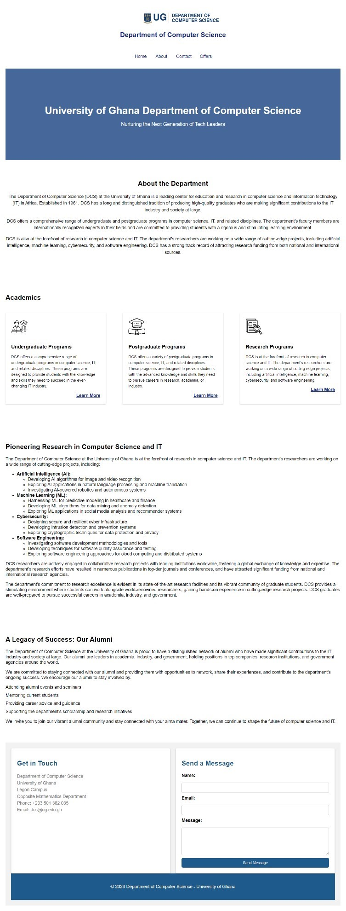
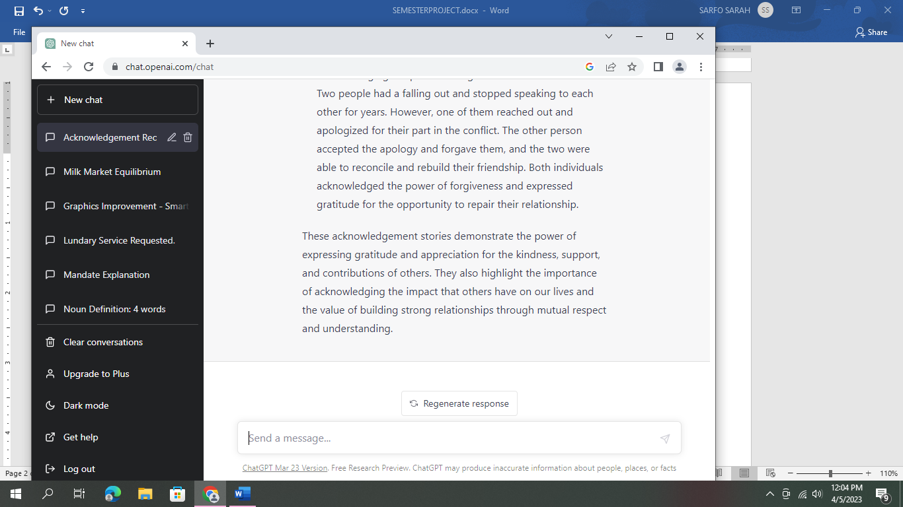
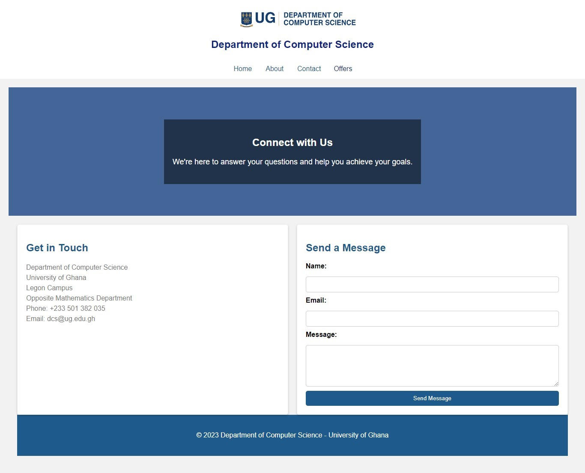
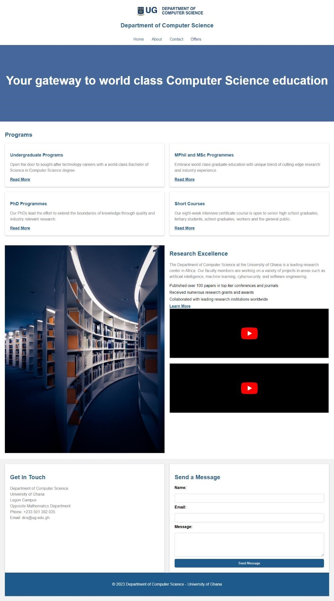

# DCIT_205_IA

# SARFO SARAH

# 11261099

# Website Introduction and Purpose

# Introduction:

The website represents the online presence of the Department of Computer Science at the University of Ghana. It serves as an informative platform for current and prospective students, as well as individuals interested in computer science education. The site appears to be wellorganized, with different sections catering to various aspects of the department's offerings.

# Key Sections and Purposes:

1. Navigation Bar:
   The navigation bar suggests that the website provides information about the home, about the department, contact details, and various academic programs, including undergraduate, master's, and Ph.D. programs.
2. Short Courses Section:
   The "Short Courses" section indicates that the department offers specialized short courses, allowing individuals to enhance their skills in specific areas of computer science. It emphasizes the practical and skill-oriented nature of these courses.
3. Specialized Program Sections:
   Sections like "Computer Networking," "Data Science," and "Mobile Application Development" suggest that the department offers specialized programs in these areas. Each section provides details about the field, resources for learning, benefits, and encourages community engagement.
4. Community Engagement:
   The inclusion of community engagement sections in each program area (e.g., "Join the Data Science Community") indicates an emphasis on networking, collaboration, and staying connected with professionals and learners in the respective fields.
5. Footer:
   The footer typically contains copyright information and serves as a consistent element across all pages, providing essential details about the department and the university.
   Purpose:
   The website's primary purpose is to serve as an informational hub for individuals interested in pursuing computer science education at the University of Ghana. It aims to attract students to various academic programs, promote short courses for skill enhancement, and foster community engagement within specific fields of computer science.

# How to Clone and Set up this website

1. Create a new repository on GitHub by clicking on the "New" button on your GitHub homepage.
2. Give your repository a name and choose whether it should be public or private.
3. Once the repository is created, copy the repository's URL.
4. Open your terminal or command prompt and navigate to the directory where you want to clone the repository.
5. Use the git clone command followed by the repository's URL to clone the repository to your local machine.

https://github.com/Sarfo-Sarah/IA/tree/main/project/project

6. After cloning the repository, navigate into the project directory using the cd command.
7. Now you can start setting up your website. Create and edit your HTML, CSS, and other necessary files.
8. Once you have made the desired changes, use the following commands to commit and push your changes to GitHub:

git add .
git commit -m " git clone: Initialize Repository with Website Clone

- Cloned the entire contents of the Department of Computer Science website from the University of Ghana.
- This commit marks the starting point for our local development environment.
- The cloned files include HTML, CSS, and JavaScript, capturing the website structure and styling."
  git push origin master
  Replace " git clone: Initialize Repository with Website Clone

- Cloned the entire contents of the Department of Computer Science website from the University of Ghana.
- This commit marks the starting point for our local development environment.
- The cloned files include HTML, CSS, and JavaScript, capturing the website structure and styling." with a brief description of the changes you made.

9.  Your website should now be successfully set up on GitHub. You can access it by visiting https://your-username.github.io/your-repository.

        # Screenshot Of The Pages

    
    
    
    
    
    
    
    
    
    
    

    ## What I have learned from the project

    _Learnings_

1.  Solid Foundation:Strengthened my understanding of HTML, CSS, and JavaScript, establishing a solid foundation in web development.

1.  Responsive Design: Implemented responsive design principles to ensure the project's compatibility with various devices and screen sizes.

1.  Interactivity: Developed interactive features using JavaScript, enhancing user engagement and creating a dynamic user experience.

1.  Debugging Skills: Improved my ability to identify and fix bugs, enhancing my debugging skills.

1.  Version Control: Used Git for version control, enabling better collaboration and tracking changes throughout the project.

1.  User Interface Design: Explored UI design principles to create an aesthetically pleasing and user-friendly interface.
    Challenges

1.Cross-Browser Compatibility:Ensuring consistent behavior across different browsers posed challenges, especially with Internet Explorer.

2. Responsive Design Complexity: Handling responsiveness for various devices required careful consideration and testing to avoid layout issues.

3. JavaScript Debugging: Debugging JavaScript code, especially in asynchronous operations, presented challenges in identifying and fixing errors.

## Improvements:

1. Enhanced UI/UX: Refine the user interface for a more polished and intuitive user experience.
2. Advanced JavaScript Techniques: Explore advanced JavaScript techniques.
3. Testing Procedures: Develop comprehensive testing procedures, including unit tests and endto-end tests, for better code reliability.
4. Code Splitting: Implement code splitting to optimize the loading of resources and improve initial page load times.
5. Documentation Improvement: Expand and improve documentation to make it more comprehensive.
6. Scalability: Assess and improve the project's architecture for scalability, considering potential future feature additions.
